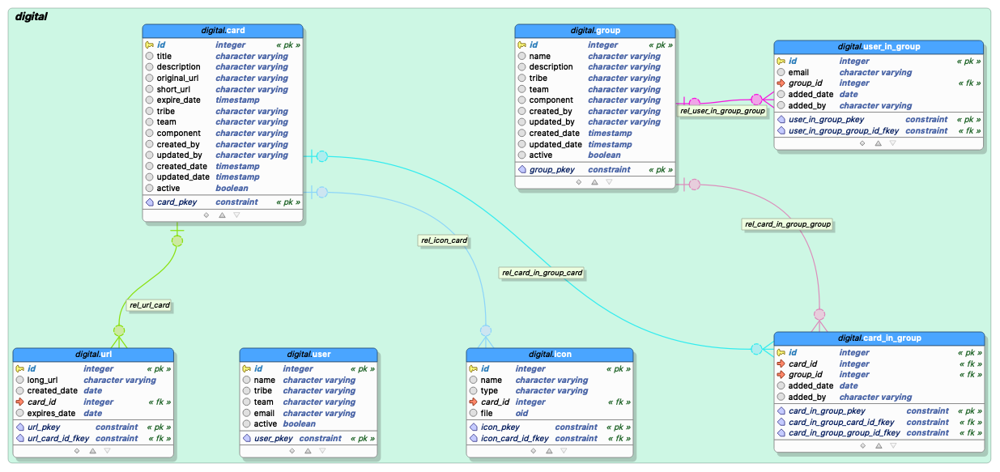

# Digital Org Application

[](https://travis-ci.com/digital-organizations/digital-org)  [](https://www.codacy.com?utm_source=github.com&amp;utm_medium=referral&amp;utm_content=abhayshukla04/digital-org&amp;utm_campaign=Badge_Grade)  [](https://codecov.io/gh/abhayshukla04/digital-org) [](https://www.npmjs.com/@angular/core)

#####appUrl: [digital-organization](https://digital-organizations.github.io/digital-org.github.io/)
  
#####openApiUrl: [digital-organizations swagger-ui](https://digital-org.herokuapp.com/swagger-ui/#/)

#####monitoringUrl: [Kibana](https://604d8e9e397a4a2eb81b1b2c5ee7f96c.eastus2.azure.elastic-cloud.com:9243/app/home#/tutorial/apm)
username : elastic
password : [copy from this link](https://github.com/digital-organizations/digital-org/src/main/resources/application.properties)

repositories: 

```    -
      name: digital-org
      githubUrl: https://github.com/digital-organizations/digital-org
      travisUrl: https://travis-ci.com/github/digital-organizations/digital-org
      codacyUrl: https://app.codacy.com/manual/abhayshukla04/digital-org/dashboard
      coverageUrl: https://codecov.io/gh/abhayshukla04/digital-org
```

```    
    - name: digital-org-ui
      githubUrl: https://github.com/digital-organizations/digital-org-ui
      travisUrl: https://travis-ci.com/github/digital-organizations/digital-org-ui
      circleUrl: https://travis-ci.com/github/digital-organizations/digital-org-ui
      codacyUrl: https://app.codacy.com/manual/abhayshukla04/digital-org-ui/dashboard
      coverageUrl: https://codecov.io/gh/abhayshukla04/digital-org-ui
```

####PostgreSQL schema(Hosted on AWS)

  


## 1. How to start in local

Springboot : http://localhost:8080/swagger-ui/#/  (based on server.port)
```
$ git clone
$ cd digital-org
$ mvn spring-boot:run

```


Angular  : http://localhost:4200
```
$ git clone
$ cd digital-org-ui
$ npm install
$ ng serve

```

Heroku CLI :
```
$ heroku login
$ heroku apps
$ heroku logs -t --app digital-org

